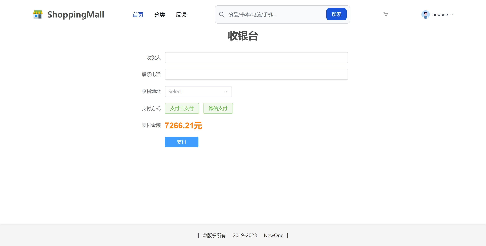

# SpringBoot-Mall

## 一、介绍
前后端分离购物商城

技术栈：Spring Boot + Mybatis Plus + Vue3 + Element Plus + tailwindcss

## 二、软件架构

### 前端目录：

### 后端目录：

## 三、安装教程

- git pull 拉取此仓库

- 后端：springboot-mall

​			用IDEA打开springboot-mall目录。

- 前端：vue-mall
  1. 用VSCode打开vue-mall目录
  2. 运行`npm install`安装依赖。
  3. 运行项目`npm run dev`

## 四、页面展示

**登录**

**首页**

**分类**

**商品详情**

**购物车**

**客服**

**支付**

**订单**

